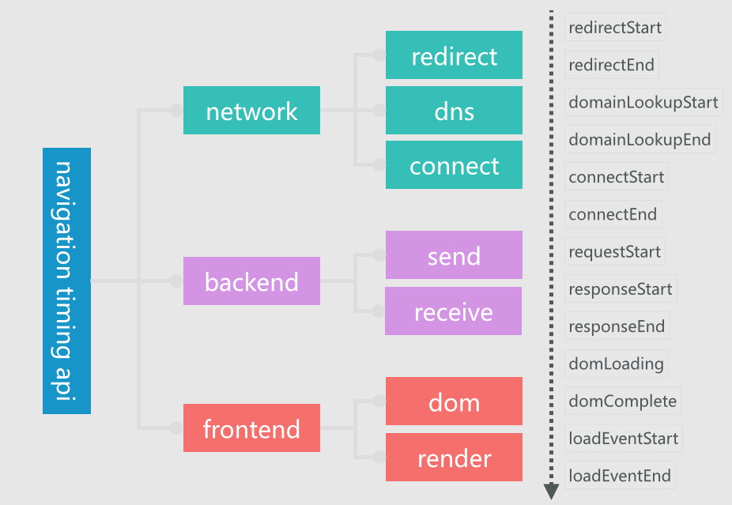
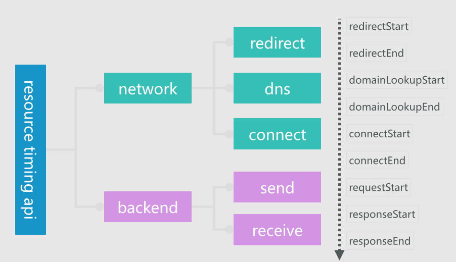

# Performance-Monitoring
为showjoy前端组开发的前端性能监控系统
## 需求

服务器自动跑线上页面，收集性能指标数据，前端展示数据。
收集真实用户的线上性能数据，在后台页面展示。
## 参考文档

 - http://fex.baidu.com/blog/2014/05/build-performance-monitor-in-7-days/
 - https://github.com/hax/WebPerf
 - http://mp.weixin.qq.com/s?__biz=MjM5MTA1MjAxMQ==&mid=400023974&idx=1&sn=12658409ddc4a56d4381ad9322fbd4a8&scene=1&srcid=1020NgATVsXLudFoN6Lpd9wi&key=b410d3164f5f798e6f765418b59f2c5ca4ad8d92f002223cdaada282f3c9f4f94889ce1e05e580f7dc6223c422a503d4&ascene=0&uin=Mjg1NTY1OTY2MA%3D%3D&devicetype=iMac+MacBookPro12%2C1+OSX+OSX+10.10.4+build(14E46)&version=11020201&pass_ticket=QZ3ZC%2BOgTYgxkormhPhCBIc3hXXCX%2FtWWCcOU7nhBgUnedppYUyiO3Yr%2BZyv%2F3%2BI
 - http://www.infoq.com/cn/articles/html5-performance-api-monitoring
 - https://github.com/huanleguang/hlg-front/tree/master/%E5%89%8D%E7%AB%AF%E6%80%A7%E8%83%BD%E7%9B%91%E6%8E%A7

- http://tech.meituan.com/performance-framework-and-platform.html

## 目标

 完成服务器搭建，写好埋点js，手动跑页面，得到页面加载性能的数据（json格式）。数据类型有：
 - 白屏时间
 - 页面渲染完成时间
 - 页面load时间
 - 。。。

## TODO

统计脚本：
* 主文档加载速度，利用 Navigation Timing API 取得；
* 静态资源加载速度，利用 Resource Timing API 取得；
* 首次渲染速度，IE 下用 msFirstPaint 取得，Chrome 下利用 loadTimes 取得；
* 文档生成速度，这个是后端的事，不做；

采集主文档加载速度的具体做法是：

- 在主文档 load 之前提供可缓存数据的接口，方便在统计脚本载入前就可以准备数据；
- 在主文档 load 之后注入数据收集脚本，该脚本加载完成之后会处理所有的数据；
- 利用 Navigation Timing API 收集计算得到上图中的指标；
- 给所有数据打上页面、地理位置、浏览器等标签，方便更细维度的分析；

采集静态资源的加载速度：

如果使用 CDN 的话，需要让 CDN 服务商加上 Timing-Allow-Origin 的响应头，才能拿到静态资源的数据。

本地性能监控：

直接用 [PhantomJS](http://phantomjs.org/)，所有数据都有了

需要统计的一些数据：<http://fex.baidu.com/blog/2014/05/front_end-data/>，
更多的数据项可以直接看 oneAPM 的吧。
